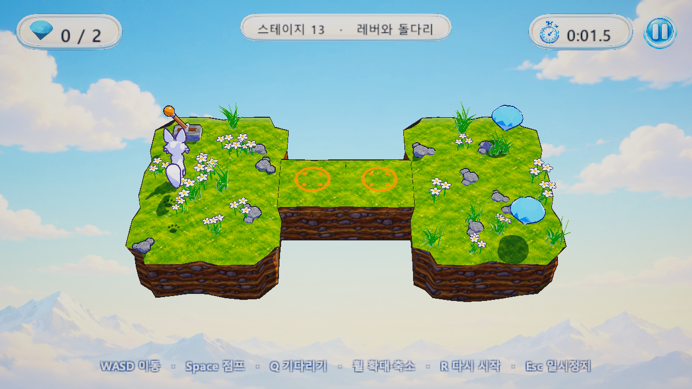

# White Fox (하얀 여우 퍼즐)

하얀 여우가 떠 있는 섬 위를 한 칸씩 움직여 **보석을 모두 먹으면 클리어**, 구멍이나 맵 밖으로 떨어지거나 적과 부딪히면 실패하는 3D 턴 방식 퍼즐 게임입니다. 여우와 소품은 Blender 스크립트로, 게임은 Unity로, 텍스처와 GUI 그림은 Codex 이미지 생성으로 만들었습니다.



- 플랫폼: **Windows 전용**
- 엔진: Unity 6000.5.7f1 (URP 17.5, Input System)
- 모델: Blender 5.2 (모두 Python 스크립트로 생성)
- 스테이지: 16개 (맵툴로 만들고 JSON으로 저장)
- 테스트: EditMode 68개 + PlayMode 32개 = 100개 통과

---

## 조작

| 키 | 동작 |
|---|---|
| W A S D | 한 칸 이동 (막히면 그쪽을 바라봄, 레버는 당김, 상자는 밂) |
| Space | 바라보는 방향으로 점프 (두 칸 앞, 또는 바로 앞의 1~2층 높은 칸 위로) |
| Q | 제자리에서 한 턴 기다리기 |
| 마우스 휠 | 확대·축소 (확대하면 여우를 따라감) |
| R | 다시 시작 |
| Esc | 일시정지 |

## 화면 흐름

메인(시작·이어하기·설정·종료) → 스테이지 선택(해금된 것만, 최고 기록) → 게임 → 결과 창 → 다음 스테이지 / 엔딩. 설정(음량, 진행 초기화)과 일시정지 창이 있습니다. 진행과 최고 기록은 PlayerPrefs에 저장됩니다.

## 게임 규칙

### 이동과 높이
- 칸마다 **층(1~9)** 이 있습니다. 걸어서는 1층 높은 곳까지 올라가고, 점프로는 바로 앞 칸이 1~2층 높으면 그 위로 뛰어오릅니다. 내려가는 것은 몇 층이든 됩니다.
- 점프는 바로 앞이 높지 않으면 두 칸 앞에 내려앉습니다. 가운데 칸이 2층 이상 솟아 있으면 넘지 못합니다.
- 구멍, 맵 밖, 무너진 칸, 꺼진 다리로 가면 떨어져 실패합니다.

### 턴 방식
여우가 한 번 행동(걷기, 점프, 부딪히기, 레버 당기기, 상자 밀기, 기다리기)하면 **한 턴**이 지나고 적과 발판이 한 칸씩 움직입니다. 얼음에서 여러 칸 미끄러져도 한 턴입니다.

순서: 여우 행동 → 바닥 변화(무너짐·스위치·상자·레버·채널) → 턴 +1 → 발판 이동(타고 있으면 실려 감) → 적과 부딪혔는지 확인.

### 칸 종류

| 기호 | 칸 | 설명 |
|---|---|---|
| `.` | 땅 | 기본 땅 |
| `O` | 구멍 | 떨어짐 |
| `#` | 바위 | 막힘 (점프로 넘을 수 있음) |
| `I` | 얼음 | 들어서면 같은 방향으로 계속 미끄러짐 |
| `C` | 무너지는 칸 | 한 번 밟고 떠나면 무너져 구멍이 됨 |
| `W` | 스위치 | 밟으면 모든 문이 영원히 열림 |
| `D` | 문 | 닫혀 있으면 막힘 |
| `T` | 계단 | 높이 차와 상관없이 오르내림 |
| `L` | 레버 | 부딪히면 당겨서 채널을 켜고 끔 |
| `P` | 누름판 | 여우나 상자가 올라가 있는 동안 채널을 켬 |
| `B` | 솟는 다리 | 채널이 꺼지면 구멍, 켜지면 아래에서 돌기둥이 솟아 땅이 됨 |
| `E` | 승강 땅 | 채널이 켜지면 정한 층으로 오르내림 |

물건: `G` 보석, `S` 시작 위치, `K` 미는 상자.

### 움직이는 것
- **눈덩이**: 정해진 길을 왕복하며 굴러다니는 적입니다. 땅 위로만 다닙니다.
- **부엉이**: 구멍 위로도 날아다니는 적입니다.
- **떠다니는 발판**: 구멍 위를 왕복합니다. 발판 위에 서 있으면 함께 실려 갑니다.
- 적이 있는 칸으로 들어가거나, 적이 여우 칸으로 들어오거나, 서로 엇갈리면 실패합니다. 점프로 적을 넘는 것은 괜찮습니다.

### 장치와 바뀌는 땅
- 장치(레버·누름판)와 바뀌는 땅(솟는 다리·승강 땅)은 **채널 1~4**(주황·파랑·초록·노랑)로 연결됩니다.
- **상자**는 한 칸씩 밀립니다. 건너편이 막혔거나 더 높으면 밀리지 않고, **구멍으로 밀면 떨어져 그 구멍을 메웁니다.** 누름판을 누를 수 있습니다.
- 누름판에서 내려와 다리 위로 가면 다리가 사라져 떨어집니다. 상자를 올려 두면 계속 켜 둘 수 있습니다.

### 연출
카툰 렌더링(셀 명암·외곽선·애니메이션 눈 표정), 걸을 때 발자국, 착지 먼지, 보석 주변 반짝임, 클리어 때 카메라가 여우에게 다가가기, 적·발판의 길을 바닥에 점으로 표시.

## 스테이지

| # | 이름 | 크기 | 주제 |
|---|---|---|---|
| 1 | 첫 번째 숲 | 4×4 | 처음 스테이지 |
| 2 | 징검다리 들판 | 5×5 | 구멍과 점프 |
| 3 | 바위 골짜기 | 6×4 | 바위와 구멍 |
| 4 | 죽음의 골자기 | 8×8 | 사용자 제작 스테이지 |
| 5 | 언덕 오르기 | 5×5 | 층 |
| 6 | 미끄러운 연못 | 5×5 | 얼음 |
| 7 | 무너지는 다리 | 5×4 | 무너지는 칸 |
| 8 | 잠긴 보물 | 5×5 | 스위치와 문 |
| 9 | 돌계단 언덕 | 5×5 | 계단 |
| 10 | 눈덩이 길 | 5×5 | 눈덩이 |
| 11 | 부엉이 순찰 | 5×5 | 부엉이 |
| 12 | 떠다니는 발판 | 6×3 | 발판 |
| 13 | 레버와 돌다리 | 6×3 | 레버·솟는 다리 |
| 14 | 누름판과 상자 | 6×4 | 누름판·상자 |
| 15 | 구멍 메우기 | 7×3 | 상자로 구멍 메우기 |
| 16 | 오르내리는 땅 | 5×5 | 승강 땅 |

스테이지 파일: `FoxGame/Assets/Resources/Stages/stage_NN.json` (현재 버전 5). **JSON은 직접 고치지 않고 맵툴에서만 고칩니다.** 옛 버전(1~4) 파일도 읽습니다.

```json
{
  "version": 5, "name": "레버와 돌다리", "width": 6, "height": 3,
  "rows":     ["L.OO..", "..BB..", "..OO.."],
  "items":    [".....G", "......", "S....G"],
  "floors":   ["111111", "111111", "111111"],
  "channels": ["1.....", "..11..", "......"],
  "floorsOn": ["......", "......", "......"],
  "movers":   [ { "kind": "snowball", "path": [ {"x":2,"y":0}, {"x":2,"y":1} ] } ]
}
```
`rows[0]`이 가장 먼 줄, 마지막 줄이 카메라 쪽입니다. 좌표는 x 왼쪽→오른쪽, y 아래(카메라 쪽)→위입니다.

## 맵툴

Unity 메뉴 **FoxGame › 맵툴** (Ctrl+Shift+M). 스테이지 JSON을 더블클릭해도 열립니다.

- 스테이지 목록: 새로 만들기, 복제, 순서 바꾸기, 삭제
- 붓: 1~8 바닥, 9 보석, 0 시작, H 높이(Q/E로 층), 레버·누름판·솟는 다리·승강 땅·상자, C 채널
- 움직이는 것: [+ 눈덩이] [+ 부엉이] [+ 발판] → 그리드에서 칸을 차례로 눌러 길 그리기
- 크기 바꾸기, 이름, 실행 취소/다시 실행, 씬에 미리보기, "이 스테이지로 플레이"
- **검증**: 저장 전에 한 판에 모든 보석을 모을 수 있는지 넓이 우선 탐색으로 확인합니다. 무너진 칸, 문, 턴 주기, 상자 위치, 메운 구멍, 레버 상태까지 포함하며, 갈 수 없는 보석은 빨간 테두리로 표시합니다.

## 폴더 구조

```
blueprint.md            원본 기획
PLAN.md, TASKS.md       계획서와 할일 (단계별 체크)
docs/                   기능별 설계 문서 (HTML)
art/                    Codex 이미지 생성 프롬프트와 원본 그림
fox/                    여우 Blender 스크립트(build_fox.py), 렌더 확인, 미리보기(preview.html)
tiles/                  타일·소품·적·장치 Blender 스크립트와 FBX
FoxGame/                Unity 프로젝트
  Assets/Scripts/Map    MapData·MapJson·MoveRules(이동·턴 규칙)·MapValidator·StageLibrary
  Assets/Scripts/Board  Board(배치·판 상태 연출)·TerrainBuilder(섬 지형 메시)
  Assets/Scripts/Fox    FoxController·FoxExpression(표정)·FoxTrail(발자국·먼지)
  Assets/Scripts/Game   GameManager·GameUI·TurnSystem·CameraFit·CameraZoom·SaveData·SceneFlow·Gem
  Assets/Scripts/Menu   메인·스테이지 선택·설정·엔딩
  Assets/Shaders        FoxToon(셀 셰이딩+외곽선)·Terrain(트라이플래너)·ToonDecal(눈)
  Assets/Editor         ProjectSetup(재질·프리팹·씬 자동 생성)·BuildWindows·MapTool
  Assets/Tests          EditMode·PlayMode 테스트
  Screenshots           확인용 캡처
```

## 만들기와 실행

모든 에셋 설정(재질, 프리팹, 씬, 빌드 목록)은 코드로 다시 만들 수 있습니다.

```bash
# 1) 모델 다시 만들기 (필요할 때만) — 결과 FBX를 FoxGame/Assets/Models 로 복사
blender -b -P fox/build_fox.py
blender -b -P tiles/build_mechanisms.py

# 2) 재질·프리팹·씬 생성
Unity.exe -batchmode -projectPath FoxGame -executeMethod ProjectSetup.Run -quit

# 3) 테스트
Unity.exe -batchmode -projectPath FoxGame -runTests -testPlatform EditMode -testResults edit.xml
Unity.exe -batchmode -projectPath FoxGame -runTests -testPlatform PlayMode -testResults play.xml

# 4) Windows 빌드 → Build/WhiteFox/WhiteFox.exe  (실행 인자 -stage N 으로 바로 그 스테이지)
Unity.exe -batchmode -projectPath FoxGame -executeMethod BuildWindows.Build -quit
```

배치 모드에서 PowerShell `Start-Process -Wait`는 라이선스 자식 프로세스까지 기다려 멈추므로 `-PassThru` 뒤 `WaitForExit()`를 씁니다.

## 개발 기록

| 단계 | 내용 |
|---|---|
| 1 | 여우 모델링(Codex 참고 그림 → Blender 재모델링), 대기·이동·점프 애니메이션, HTML 미리보기 |
| 2~4 | Unity 프로젝트, Codex 텍스처 타일맵, 여우 이동, 게임 로직(보석·낙하·클리어) |
| 5 | 맵툴 + JSON 스테이지 (가변 크기·가변 보석·1~n 스테이지) |
| 6 | 2층·3층·n층 (걸어서 1층, 점프로 2층) |
| 7 | 화면 흐름 (메인·스테이지 선택·게임·엔딩·설정·일시정지), Codex GUI |
| 8 | 퍼즐 칸: 얼음·무너지는 칸·스위치와 문·계단 |
| 9 | 타일 대신 하나로 이어진 섬 지형 (TerrainBuilder), 후처리 |
| 10 | 여우 카툰 렌더링 → 화풍 통일, 애니메이션 눈, 외곽선 조정 |
| 11 | 마우스 휠 확대·축소 |
| 12 | 움직이는 적(눈덩이·부엉이)·떠다니는 발판, 턴 방식, 연출(발자국·먼지·반짝임·클리어 카메라) |
| 13 | 장치: 레버·누름판·미는 상자, 솟는 다리·승강 땅 |

자세한 항목은 [TASKS.md](TASKS.md)와 `docs/` 문서에 있습니다.
